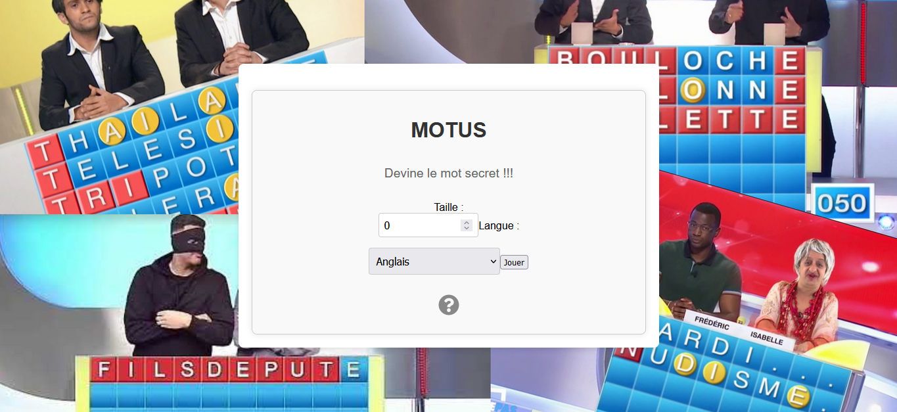

# Wordle/Motus - Jeu de mots en React

Wordle est une application de jeu de mots développée en React, inspirée du jeu télévisé français "Motus". Le but du jeu est de deviner un mot et de recevoir des indices sur chaque tentative.

## Fonctionnalités

- Deviner un mot en plusieurs tentatives.
- Indicateurs visuels pour les lettres correctes et incorrectes.
- Affichage de la définition du mot une fois le jeu terminé. (grâce à une API, seulement en anglais)
- Interface utilisateur réactive et facile à utiliser.

## Capture d'écran



## Utilisation

1. Ouvrez l'application dans votre navigateur.
2. Entrez des lettres pour deviner le mot caché.
3. Recevez des indices visuels après chaque tentative.
4. Une fois le mot deviné ou les tentatives épuisées, la définition du mot sera affichée.

## Architecture du projet

- **src/Components** : Contient les composants React.
- **src/CSS** : Contient les fichiers CSS pour le style de l'application.
- **public** : Contient les fichiers statiques et le fichier HTML de base.

## Exemple de code

### Composant `Motus`

```javascript
import React, { useState, useEffect } from 'react';
import './CSS/Motus.css';
import Grille from './Grille';

const Motus = ({ mot, updateGame, language }) => {
  const [isWin, setIsWin] = useState(null);
  const [definition, setDefinition] = useState('');

  const notifyEnd = (end) => {
    if (end === 'Win') {
      setIsWin(true);
    } else {
      setIsWin(false);
    }
  }

  useEffect(() => {
    if (mot) {
      fetchDefinition(mot);
    }
  }, [mot]);

  const fetchDefinition = async (word) => {
    const url = `https://api.dictionaryapi.dev/api/v2/entries/en/${word.toLowerCase()}`;

    try {
      const response = await fetch(url);
      const data = await response.json();
      if (data && data.length > 0) {
        const definition = data[0].meanings[0].definitions[0].definition;
        setDefinition(definition);
      } else {
        setDefinition('Définition non trouvée.');
      }
    } catch (error) {
      setDefinition('Erreur lors de la récupération de la définition.');
      console.error('Erreur lors de la récupération de la définition:', error);
    }
  };

  return (
    <div className="game-container">
      <Grille mot={mot} notifyEnd={notifyEnd} />
      <div>
        {isWin === true && <p>Félicitations, vous avez gagné!</p>}
        {isWin === false && <p>Perdu !!! Le mot était "{mot}" Réessayez!</p>}
        {isWin === null && <p></p>}
        {isWin !== null && language === 'en' && (
          <div className="definition">
            <h2>Définition de {mot}:</h2>
            <p>{definition}</p>
          </div>
        )}
        {isWin !== null && (
          <button className='retry-button' onClick={() => updateGame(false)}>Rejouer</button>
        )}
      </div>
    </div>
  );
};

export default Motus;
```

## Remerciements
- Merci à l'équipe de Dictionary API pour leur API gratuite.
- Inspiration tirée du jeu télévisé "Motus".

## License

This project is licensed under the MIT License - see the [LICENSE](LICENSE) file for details.

